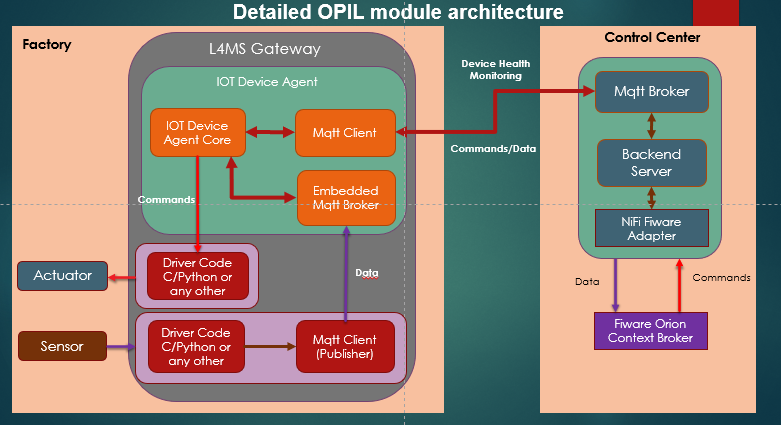
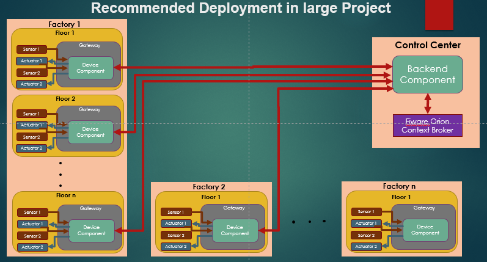

# **S**ensor **A**gent **N**ode - SAN
- **S**ensor **A**gent **N**ode - SAN

  - [Background](#background)
  - [Overview of the Architecture](#Overview-of-the-Architecture)
    - [Black box of SAN](#black-box-of-SAN)
    - [Detailed Architecture of SAN](#Detailed-Architecture-of-San)
    - [Large Project Deployment](#large-project-deployment)
  - [Prerequisites](#prerequisites)
  - [Install](#install)
    - [Backend Component Installation](#Backend-Component-Installation)
    - [Device Agent Component Installation](#Device-Agent-Component-Installation)
  - [Configuration](#configuration)
  - [Interfaces](#interfaces)
    - [Subscription to Orion Context Broker](#Subscription-to-Orion-Context-Broker)
    - [Send Commands](#Send-Commands)
  - [License](#license)
 ## Background
[OPIL](https://opil-documentation.readthedocs.io/) is the Open Platform for Innovations in Logistcs. This platform is meant to enable the development of value added services for the logistics sector in small-scale Industry 4.0 contexts such as those of manufacturing SMEs. In fact, it provides an easy deployable suite of applications for rapid development of complete logistics solutions, including components for task scheduling, path planning, automatic factory layout generation and navigation.

[Esthesis](https://github.com/esthesis-iot) is a modern Internet of Things platform, providing end-to-end management services for your devices. It consists of device management functionality, over-the-air firmware upgrade services, and a modular data-management approach. Built-in support for certificates and certificate authorities allows you to effortlessly set up a secure communication environment with your devices where provisioning packages can be signed and/or encrypted on the fly.

The **SAN** is located between OPIL and the sensor software and it is a extension of Esthesis platform. It's main features- advantages are:
**a**)Supports sensors and actuators (Input and output sensors).
**b**)Drivers of the sensors and actuators can be written in any prefered/suitable programming language(can use existing drivers), given that at the end the data are sent/retrieved through mqtt protocol, no restriction other than this.
**c**) Monitors health of host device(Disk space usage,Memory usage,Restart services, check logs for each running service,Monitor CPU temperature
).
**d**)Can be deployed to any host machine that supports java language, eg single board computers like  rpi, revpi or any other.


## Overview of the Architecture


### Black box of SAN


At the above picture we can see 2 components :

- The Device Agent Component
  - Responsible for retrieving data, send commands to I/O devives, updates


- The Backend Component
  - Responsible for  monitoring  gateway health, retrieving data, sending commands
  - Do all these functionalities directly from Orion context Broker
### Detailed Architecture of SAN
At the picture below we can see the SAN architecture in more detail. We can also see that the system supports gateways with driver codes for the sensors/actuators at any programming language.For the communication of the drivers with the Device Agent a Mqtt client is needed.

The ***Device Agent*** consists of **a)** the IoT Device Agent core **b)** an Mqtt Client **c)** an embedded Mqtt Broker

The ***Backend Component*** consists of **a)** an Mqtt Broker **b)** the Backend Server **c)** a Custom Fiware Adapter


### Large Project Deployment
Below there is a large project deployment demontration.A Backend Component can support multiple Device Agent components.The Device Agent Component can be deployed to any host machine that supports java language, eg single board computers like  rpi, revpi or any other.
 



## Prerequisites
Any device that supports Docker engine 
## Install

### Backend Component Installation

Backend Component can be installed with the following Command:
docker-compose up

### Device Agent Component Installation
Execute the following command:

 docker run --name esthesis-demo-device-rpi --network=esthesis_esthesis-prod -d  \
-e hardwareId=mydevice1 \
-e storageRoot="/app" \
-e tags=myfiwaredevice \
-e registrationUrl="http://my-esthesis-host" \
esthesis/esthesis-platform-device:latest

Enviromental variables(hardwareId,tags,registrationUrl) can be adjusted at any use case.
## Configuration

The configurations take place at .env file at config folder

## Interfaces

### Subscription to Orion Context Broker
```json
{
"description": "Updating CMD",
"subject": {
"entities": [
{
"idPattern": ".*",
"type": "EsthesisDeviceCommand"
}
],
"condition": {
"attrs": []
}
},
"notification": {
"attrs": [],
"onlyChangedAttrs": false,
"attrsFormat": "normalized",
"http": {
"url": "http://*********:20101"
}
}
}
```

The subscription to Orion Context Broker is done automatically with the installation. At ********* the internal ip of Nifi must be filled.
### Send Commands
```json
{
    "id": "testdev1_cmd",
    "type": "EsthesisDeviceCommand",
    "measurementType": {
      "type": "string",
      "value": "string",
      "metadata": {}
    },
    "modifiedTime": {
      "type": "string",
      "value": "2021-03-10T18:08:31.399Z",
      "metadata": {}
    },
    "readings": {
      "type": "array",
      "value": [
        {
          "type": "SensorReading",
          "value": {
            "reading": {
              "type": "string",
              "value": "*****************"
            }
          }
        }
      ],
      "metadata": {}
    },
    "sanID": {
      "type": "string",
      "value": "Esthesis_SAN_testdev1",
      "metadata": {}
    },
    "sensorID": {
      "type": "string",
      "value": "health",
      "metadata": {}
    },
    "sensorManufacturer": {
      "type": "string",
      "value": "Esthesis",
      "metadata": {}
    },
    "sensorType": {
      "type": "string",
      "value": "DeviceCommand",
      "metadata": {}
    },
    "units": {
      "type": "string",
      "value": "string",
      "metadata": {}
    }
  }
``` 
In order to send a command a http put request with id"testdev1_cmd" needs to be done. In "*****************" the command takes place. 
## License

[APACHE2](LICENSE) ©
